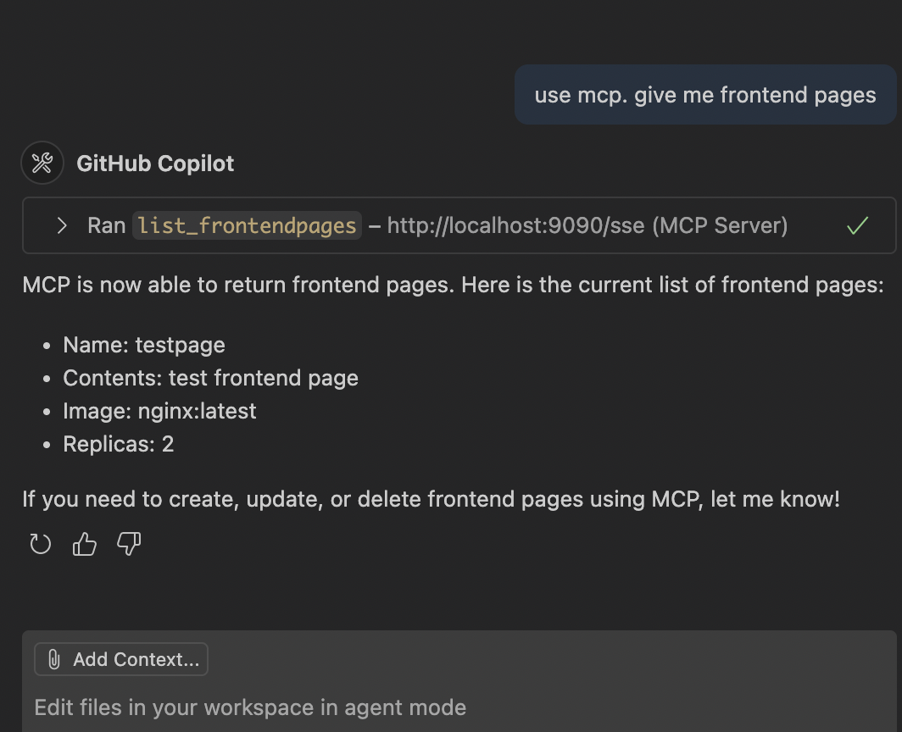

# Kubernetes Controllers Development Pattern


## About

A lightweight Kubernetes controller project built in Go, enabling interaction with Kubernetes resources through a custom HTTP API and Kubernetes-native reconciliation logic.

This project demonstrates advanced controller patterns including:

- Dynamic reconciliation with `controller-runtime`
- Custom Resource Definitions (CRDs) via `controller-gen`
- Integration with `client-go` for listing and watching resources
- HTTP-based API server for interacting with cluster state
- CI/CD-ready container image builds and Helm-based deployments

---

## Project Structure

```text
k8s-controller-patterns/
├── cmd/                           # CLI commands
│   ├── goBasic.go, list.go        # Basic and list commands
│   ├── mcp.go, server.go          # MCP + API server commands
│   └── *_test.go                  # Tests
│
├── pkg/                           # Core packages
│   ├── api/                       # HTTP API and JWT middleware
│   ├── apis/frontend/v1alpha1/    # CRD definitions
│   ├── ctrl/                      # Reconciler logic
│   ├── informer/                  # Shared informers
│   └── testutil/                  # envtest helpers
│
├── config/crd/                    # CRD YAMLs
│
├── charts/app/                    # Helm chart
│
├── docs/                          # Swagger specs + Images
│
├── setup-amd64.sh                # Local control plane setup script
├── Makefile, Dockerfile          # Build definitions
├── main.go                       # CLI entrypoint
├── .github/workflows             # CI/CD GitHub Actions
```

---

## Prerequisites

- Go 1.24.0 or later
- Kubernetes cluster
- Docker
- Helm 3.x

---

## Steps of implementations

#### 0. Set-up control plane in Codespace via script

```bash
./setup-amd64.sh start
./setup-amd64.sh stop
./setup-amd64.sh cleanup
```

#### 1. Set-up control plane via script

```bash
go run main.go go-basic
go test ./cmd
go build -o controller
./controller go-basic
```

#### 2. Add logging

```bash
go build -o controller
./controller --log-level info
./controller --log-level debug
./controller --log-level trace
```

#### 3. Add FastHTTP server

```bash
go run main.go server --log-level trace
```

#### 4. Add CI-CD

```bash
make run #default run
make run ARGS="server --log-level debug" #run with arguments
make build
docker run -p 8080:8080 k8s-controller-patterns:latest server --log-level debug

export KUBECONFIG=~/.kube/config
export KUBEBUILDER_ASSETS=$(pwd)/kubebuilder/bin

# if private container-registry
export GITHUB_PAT=<GITHUB_TOKEN>
echo $GITHUB_PAT | docker login ghcr.io -u ibra86 --password-stdin
kubectl create secret docker-registry ghcr-secret \
  --docker-server=ghcr.io \
  --docker-username=ibra86 \
  --docker-password=$GITHUB_PAT \
  --docker-email=<user-email> \
  --dry-run=client -o yaml > secret.yaml
kubectl apply -f secret.yaml

#if publich container
sudo kubebuilder/bin/kubectl taint nodes $(hostname) node.cloudprovider.kubernetes.io/uninitialized=true:NoSchedule


# alternative with kubectl
kubectl create deployment k8s-controllers --image=ghcr.io/ibra86/k8s-controller-patterns:latest
kubectl expose deployment k8s-controllers --port=80 --target-port=8080 # creates a service
kubectl patch deployment k8s-controllers \
  --type='json' \
  -p='[
    {"op":"add","path":"/spec/template/spec/imagePullSecrets","value":[{"name":"ghcr-secret"}]},
    {"op":"replace","path":"/spec/template/spec/containers/0/args","value":["server","--log-level","debug"]}
  ]'
kubectl port-forward service/k8s-controllers 8080:80& # temp fwd port to a pod
kubectl logs -f <pod-id> -c k8s-controller-patterns

# alternative with helm
helm install k8s-controllers ./charts/app --set args="{server,--log-level,debug}"
kubectl port-forward service/k8s-controllers 8080:80& # temp fwd port to a pod
curl http://localhost:8080
```

#### 5. Add client-go integration

```bash
# list deployments
go run main.go list --log-level debug --kubeconfig ~/.kube/config --log-level debug

# informer deployments change
go run main.go server --log-level trace --kubeconfig ~/.kube/config

# api endpoint to list deployments
go run main.go list --log-level debug --kubeconfig ~/.kube/config --log-level
curl http://localhost:8080/deployments
```

#### 6. Add controller-runtime + CRDs

```bash
# install controller-gen -- tool to generate CRD and deepcopy code
go install sigs.k8s.io/controller-tools/cmd/controller-gen@latest

controller-gen crd:crdVersions=v1 paths=./pkg/apis/... output:crd:dir=./config/crd object paths=./pkg/apis/...
# create CRD
kubectl port-forward service/k8s-controllers 8080:80& # temp fwd port to a pod
apply -f config/crd/frontendpage.ibra86.io_frontendpages.yaml

go run main.go server --log-level trace --kubeconfig  ~/.kube/config

kubectl apply -f ./config/crd/frontendpage.yaml
kubectl patch frontendpage testpage --type=merge -p '{"spec": {"replicas": 3}}'
kubectl scale --replicas=2 deployment/testpage # not be applied - according to the state of reconcile.loop
kubectl delete deploy testpage   # won't be applied
```

#### 7. Swagger UI

```bash
curl http://localhost:8080/swagger/index.html
```

#### 7. Enable MCP Server (for Chat/Agent integrations)

```bash
go run main.go server --log-level trace --kubeconfig  ~/.kube/config --enable-mcp
# MCP is now exposed on port 9090 (default)
# Connect from IDE (e.g., Cursor - https://docs.cursor.com/context/mcp#using-mcp-json)
# -> ask: "Use MCP. Give me frontend pages."
```

Below is an example of the MCP server returning `frontendpages` via chat agent integration:


#### 8. Enable JWT Auth (for secure API access)

```bash
go run main.go server --log-level trace --kubeconfig  ~/.kube/config --enable-leader-election=0 --jwt-secret "my-secret"
TOKEN=$(curl -s -X POST http://localhost:8080/api/token | jq -r .token)
curl -H "Authorization: Bearer $TOKEN" http://localhost:8080/api/frontendpages
```
